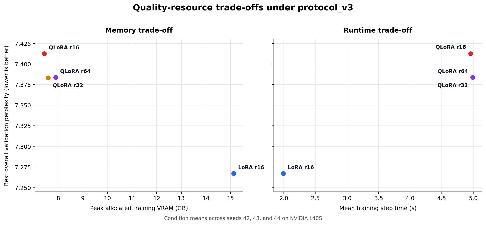

# Quantisation Effects in Parameter-Efficient Domain Adaptation

### A matched LoRA/QLoRA study on UK employment-law text

[](https://github.com/gabrielsaban/llama-peft-project/actions/workflows/validate.yml)


[](LICENSE)

A controlled empirical comparison of **LoRA and QLoRA for domain-adaptive continued
pretraining of Meta-Llama-3-8B** on a curated 1.8 million-token UK employment-law
corpus. The study measures how 4-bit NF4 quantisation changes held-out modelling
quality, GPU memory use, training runtime, and numerical stability when data and
optimisation exposure are held fixed.

> BSc Computer Science with Artificial Intelligence dissertation, University of
> Leeds, 2025/26.

**[Read the dissertation](paper/gabriel-saban-dissertation.pdf)** ·
**[Experimental protocol](logs/protocol_v3.md)** ·
**[Aggregate results](outputs/reports_index/protocol_v3/)** ·
**[Data provenance](DATA.md)**

## Key results

The final study comprises four conditions, each repeated across the shared seeds
42, 43, and 44. Values below are condition means from the committed
`protocol_v3` artefacts.

| Condition | Best validation perplexity ↓ | Train peak VRAM ↓ | Mean step time ↓ | Train runtime ↓ |
|---|---:|---:|---:|---:|
| **LoRA r16** | **7.2670** | 15.126 GB | **1.993 s** | **1,088.7 s** |
| QLoRA r16 | 7.4125 | **7.437 GB** | 4.958 s | 2,688.9 s |
| QLoRA r32 | 7.3832 | 7.590 GB | 4.983 s | 2,703.2 s |
| QLoRA r64 | 7.3837 | 7.894 GB | 4.988 s | 2,714.4 s |

- At matched rank, QLoRA reduced peak training VRAM by **50.8%** relative to
  LoRA (7.437 GB versus 15.126 GB).
- That saving came with approximately **2.5× slower training steps** and higher
  held-out perplexity than LoRA under the fixed protocol.
- Within QLoRA, increasing rank from 16 to 32 recovered some quality for only
  0.153 GB additional peak VRAM. Rank 64 produced no meaningful further overall
  improvement.
- All **12 final runs completed without NaN/Inf losses, non-finite gradient
  norms, OOM events, optimiser resets, or early termination**.

LoRA and QLoRA begin from different numerical base states: the unquantised LoRA
baseline has mean perplexity 7.9612, while the 4-bit QLoRA baseline has mean
perplexity 8.3170. QLoRA therefore improves more from its own baseline, but does
not close the absolute quality gap in this experiment.



The figure is generated directly from the tracked condition summary:

```bash
python scripts/plot_protocol_v3_tradeoff.py
```

These are **intrinsic language-modelling results under the fixed `protocol_v3`
configuration**. They are not a universal ranking of LoRA and QLoRA and do not
demonstrate factual accuracy, citation quality, legal reasoning, or practitioner
usefulness.

## Study design

| Component | Fixed design |
|---|---|
| Base model | `meta-llama/Meta-Llama-3-8B` |
| Adaptation | LoRA r16; QLoRA r16, r32, and r64 |
| Quantisation | 4-bit NF4 with double quantisation for QLoRA |
| Corpus | 1,802,427 tokens across 230 documents |
| Split | Fixed 85/15 document-level split, stratified by layer and token-length quartile |
| Training budget | 350 optimiser steps; 8,192 tokens per optimiser step |
| Seeds | 42, 43, and 44 for every condition |
| Hardware | NVIDIA L40S |
| Primary endpoint | Best-checkpoint overall validation perplexity |
| Systems outcomes | Peak allocated training VRAM, step time, total runtime, and objective stability events |

The corpus combines 170 employment tribunal judgments (Layer A) with 60 pieces
of authoritative guidance and doctrine from Acas, GOV.UK, and the House of
Commons Library (Layer B). Documents were cleaned, capped in Llama-3 token space,
and frozen before the reportable runs. See [DATA.md](DATA.md) for source and
licensing boundaries.

## Reproducing the study

### 1. Create the environment

The recorded environment uses Python 3.11 and CUDA 12.1.

```bash
conda env create -f environment.yaml
conda activate llama-peft
```

Alternatively:

```bash
python3.11 -m venv .venv
source .venv/bin/activate
pip install -r requirements.txt
```

Training requires suitable NVIDIA GPU hardware and authorised Hugging Face
access to `meta-llama/Meta-Llama-3-8B`. Authentication is read from `HF_TOKEN`
or an existing Hugging Face login; credentials are not stored here.

### 2. Inspect the frozen artefact

```bash
scripts/reproduce_protocol_v3.sh inspect
python scripts/validate_protocol_v3_artifact.py
```

### 3. Rebuild the aggregate reports

```bash
scripts/reproduce_protocol_v3.sh aggregate
```

This regenerates the CSV and JSON summaries in
`outputs/reports_index/protocol_v3/` from the saved per-run reports.

### 4. Run the final configurations

```bash
scripts/reproduce_protocol_v3.sh single \
  configs/llama3_8b_lora_l40_protocol_v3_phase1_r16_seed42.yaml

scripts/reproduce_protocol_v3.sh phase1
scripts/reproduce_protocol_v3.sh phase2
scripts/reproduce_protocol_v3.sh slurm phase1
scripts/reproduce_protocol_v3.sh slurm phase2
```

## Repository map

```text
final study
├── configs/*protocol_v3*.yaml              frozen run configurations
├── data/domain_corpus/                     frozen corpus and manifest
├── data/splits/intrinsic_splits.json       fixed document split
├── logs/protocol_v3.md                     protocol definition and rationale
├── outputs/experiments/protocol_v3/        structured per-run evidence
├── outputs/reports_index/protocol_v3/      aggregate CSV/JSON results
├── scripts/reproduce_protocol_v3.sh        inspection and execution entry point
└── paper/gabriel-saban-dissertation.pdf    final dissertation

implementation and audit history
├── src/                                    training, evaluation, and reporting
├── preprocess/                             corpus construction pipeline
├── scripts/                                local and cluster launch wrappers
├── configs/legacy/                         calibration configurations
└── logs/                                   protocol and development records
```

For each reportable run, the `reports/` directory records the resolved
configuration, environment, dataset quantities, evaluation history, final
metrics, memory, timing, stability, and the comparison row consumed by the
aggregate reports. Generated adapter weights and duplicated tokenizer files are
not part of the compact evidence layer.

## Scope and limitations

The evidence is deliberately bounded to one base-model family and quantisation
recipe, one L40S platform, one fixed document split, three seeds per condition,
a 350-step matched schedule, and intrinsic packed-sequence perplexity rather
than downstream legal tasks.

Accordingly, the defensible conclusion is narrow: under `protocol_v3`, QLoRA is
a practical memory-saving intervention, not a cost-free replacement for
unquantised LoRA. Different hardware, schedules, adapter targets, quantisation
schemes, or downstream objectives may change the trade-off.

## Citation

Citation metadata is available in [CITATION.cff](CITATION.cff).

```bibtex
@thesis{saban2026quantisation,
  author      = {Gabriel Saban},
  title       = {Quantisation Effects in Parameter-Efficient Domain Adaptation:
                 A Matched LoRA/QLoRA Study on UK Employment-Law Text},
  type        = {BSc dissertation},
  institution = {University of Leeds},
  year        = {2026},
  url         = {https://github.com/gabrielsaban/llama-peft-project}
}
```

## Licensing and attribution

Original project code is released under the [MIT License](LICENSE). That licence
does not relicense the dissertation, Meta-Llama-3-8B, third-party libraries, or
the public legal and guidance documents used to construct the corpus. See
[DATA.md](DATA.md) and [LICENSING.md](LICENSING.md) for the exact boundaries.

## Acknowledgements

This repository accompanies a final-year project completed in the School of
Computer Science at the University of Leeds. It builds on PyTorch, Hugging Face
Transformers, PEFT, bitsandbytes, Datasets, Accelerate, and the externally
released Meta-Llama-3-8B base model.
